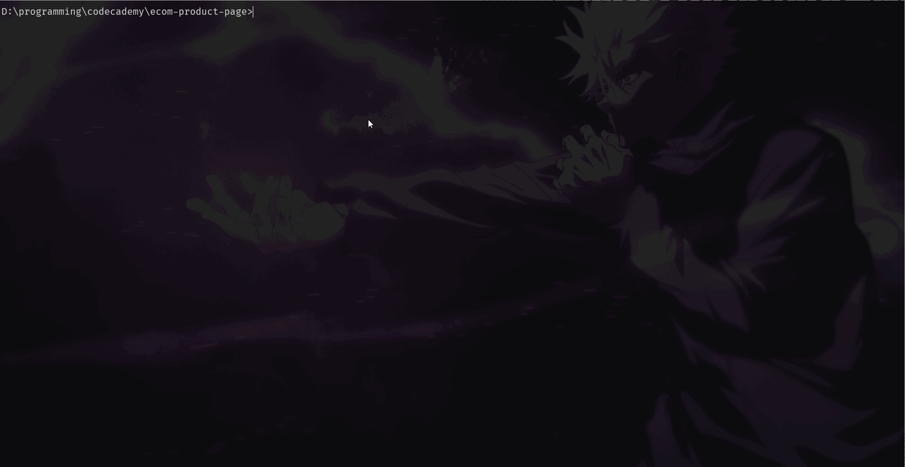
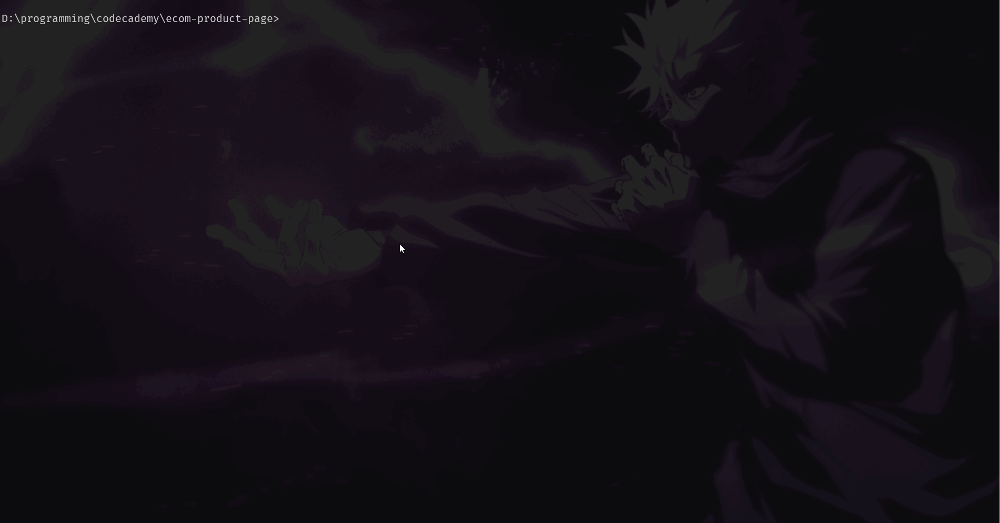

<h1 align="center">
  <a href="https://github.com/Goku-kun/ecom-product-page">
    E-commerce Product Page
  </a>
</h1>

[](https://github.com/Goku-kun/ecom-product-page/issues?q=is%3Aissue+is%3Aopen+label%3A%22help+wanted%22)
[](https://github.com/Goku-kun)

</div>

---

## About

E-commerce Product Page is the implementation of [this FrontendMentor challenge](https://www.frontendmentor.io/challenges/ecommerce-product-page-UPsZ9MJp6) by the same name.

This project is intended to serve as a standalone component product page inside an e-commerce platform to display a product.

<div align="center">
Checkout the <a href="https://codecademy-ecom-page.web.app">live demo</a> of the main branch.
</div>

### Technologies used

-  React
-  Firebase
-  Redux
-  Sass

## Getting Started

### Prerequisites

1. Install the dependences:

```sh
npm install
```



## Usage

Build and serve the project using:

```sh
npm run serve-build
```



## Project Status

Version: 0.1.0 is live

## New Features and Issues

See the [open issues](https://github.com/Goku-kun/ecom-product-page/issues) for a list of proposed features (and known issues).

## Contributing

First off, thanks for taking the time to contribute! Contributions are what make the open-source community such an amazing place to learn, inspire, and create. Any contributions you make will benefit everybody else and are **greatly appreciated**.

Please read [our contribution guidelines](docs/CONTRIBUTING.md), and thank you for being involved!

## License

This project is licensed under the **MIT license**.

See [LICENSE](LICENSE) for more information.

## Acknowledgements

This project was created a part of a Beta group collaboration project under [Codecademy](https://codecademy.com).

Special thanks to [Cassie Spain](https://github.com/dreamwasp) for serving as the project mentor.

## Support and Contact

Reach out to the maintainer at one of the following places:

- [GitHub issues](https://github.com/Goku-kun/ecom-product-page/issues/new?assignees=&labels=question&template=04_SUPPORT_QUESTION.md&title=support%3A+)
- Directly reach out to [Dave Andrea](https://github.com/djblackett), [Dharma](https://github.com/Goku-kun) or [Matt Hand](https://github.com/HandMatt).
